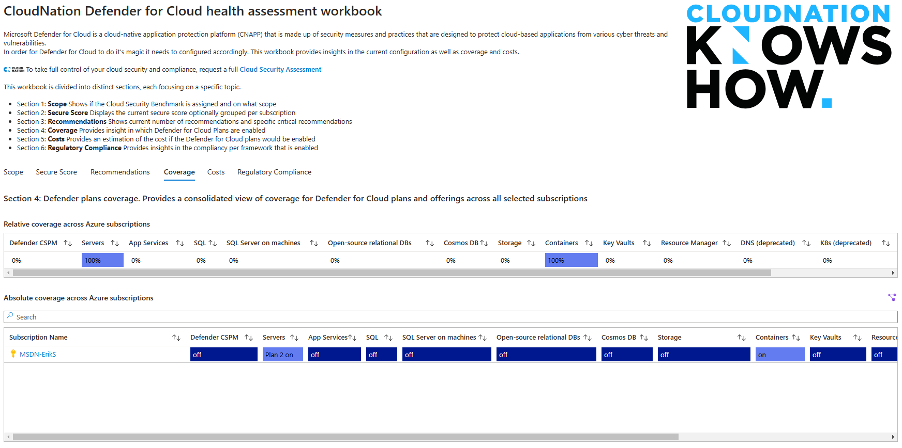

# Defender for Cloud Health Assessment workbook

**Author: Erik Snijder | Principal Consultant Cloud Security [CloudNation](https://www.cloudnation.nl)**

Microsoft Defender for Cloud is a cloud-native application protection platform (CNAPP) that is made up of security measures and practices that are designed to protect cloud-based applications from various cyber threats and vulnerabilities.  
In order for Defender for Cloud to do it's magic it needs to configured accordingly. This workbook provides insights in the current configuration as well as coverage, costs and compliance. 
 
 
 To take full control of your cloud security and compliance, request a full [ Cloud Security Assessment ](https://www.cloudnation.nl/en/services/cloud-security-assessment)
 
 
This workbook is divided into distinct sections, each focusing on a specific topic.

- Section 1: **Scope** Shows if the Cloud Security Benchmark is assigned and on what scope
- Section 2: **Secure Score** Displays the current secure score optionally grouped per subscription
- Section 3: **Recommendations** Shows current number of recommendations and specific critical recommendations
- Section 4: **Coverage** Provides insight in which Defender for Cloud Plans are enabled
- Section 5: **Costs** Provides an estimation of the cost if the Defender for Cloud plans would be enabled
- Section 6: **Regulatory Compliance** Provides insights in the compliancy per framework that is enabled 
 
 
**Example**

## Try on Portal
You can deploy the workbook by clicking on the buttons below:

